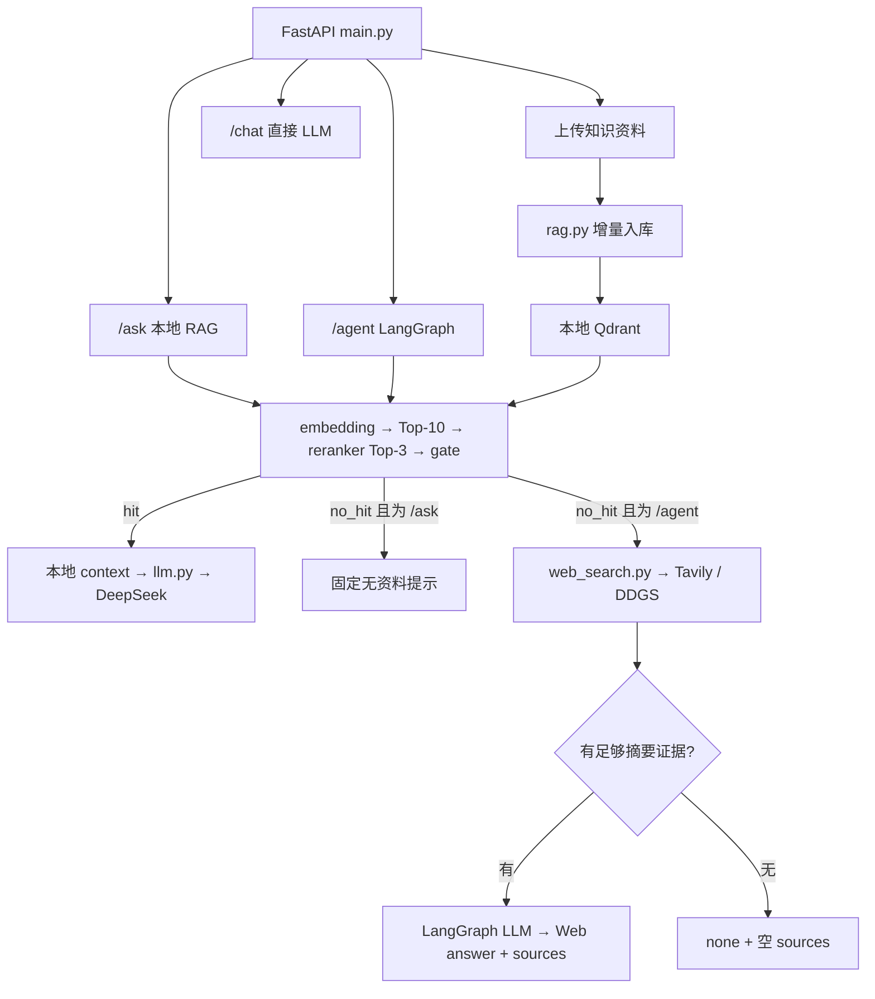

# AI Study Assistant

面向计算机学习的后端实习项目，基于 FastAPI、DeepSeek、Qdrant 和 LangGraph。用户可以上传学习资料并立即检索；Agent 优先使用本地知识库，缺少相关资料时尝试网页搜索，证据不足则明确说明。

## 解决的问题与核心功能

学习笔记分散，普通聊天回答难以追溯来源。本项目把资料上传、增量入库、检索重排和真实来源返回串联起来，覆盖 Python、Git、网络、数据库等计算机学习场景。

- TXT、Markdown、文字型 PDF 动态上传，接口等待索引完成后返回。
- SHA256 增量判断、稳定 UUID、同名资料更新与旧 chunks 清理。
- Qdrant Top-10 检索、CrossEncoder 重排 Top-3、retrieval gate。
- 本地来源及 PDF 页码；Web 来源保留搜索服务返回的标题和 URL。
- LangGraph 的 Local / Web / None 路由；资料不足时不裸答。
- 独立 QLoRA 数据准备、训练与模型对比实验。

这是单用户后端展示项目，没有前端页面，也不保证检索或生成永远正确。

## 系统架构



启动时 `main.py` 导入 `llm.py` 和 `rag.py`：读取环境配置，加载 embedding/reranker，打开本地 Qdrant 并执行 `sync_knowledge()`。LangGraph 随后编译状态图。首次运行可能需要下载检索模型。

### 知识上传流程

```text
UploadFile → 文件名/格式/大小校验 → knowledge/uploads/ 临时保存
→ ingest_file → SHA256 与 knowledge_state.json 比较
→ 文本解析 → chunk → embedding → UUID5 → Qdrant upsert
→ 清理同 source 的旧 chunks → 原子更新 knowledge_state.json
```

TXT/MD 校验 UTF-8 后先原子保存正式文件，再入库。PDF 从暂存文件解析，保存旧文件及 points 快照，成功后提交；失败执行补偿恢复。TXT/MD 没有同等完整的失败回滚机制。

`chunk_text` 按 200 **字符**切块、重叠 50 字符。PDF 逐页切块，保留原始 1-based 页码；chunk_id 在文件内连续编号。payload 保留 `text/source/chunk_id`，PDF 增加 `page`。UUID5 根据 source、chunk_id、text 生成，PDF 再包含 page。

同 source/SHA256 返回 `unchanged`，不再解析或 embedding。改名后的相同内容是不同 source，不做跨文件内容去重。手工增删资料由下次启动同步处理，没有后台文件监听。

### 问答与 Local / Web / None 路由

`retrieve_with_confidence()` 调用原检索管线：问题 embedding → Qdrant Top-10（向量阈值 0.4）→ CrossEncoder → Top-3 → 最高重排分数 gate。

```text
START → local_retrieval
  hit    → local_answer（复用本次 hits）→ END
  no_hit → prepare_web_search → tools_condition → ToolNode(web_search)
         → chatbot → web 或 none → END
```

本地 hit 必须先于 Web 分支，Web 工具调用次数为 0。`/ask` 的 no_hit 直接返回固定提示，不调用 LLM；`/agent` 的 no_hit 才进入 Web Search。

Web 空结果不调用回答 LLM。有摘要时，模型只能根据当前搜索资料回答，返回 supported、answer、used_result_ids；证据不足、格式错误、编号无效或正文输出 URL 时返回 `none`。结果充分性仍依赖模型判断，并非独立事实验证。

## 技术栈与目录

| 层次 | 实现 |
|---|---|
| API | FastAPI、Pydantic、Uvicorn、python-multipart |
| 本地检索 | SentenceTransformers `paraphrase-multilingual-MiniLM-L12-v2`、384 维 cosine Qdrant |
| 重排 | CrossEncoder `BAAI/bge-reranker-base` |
| 生成 | DeepSeek，当前代码模型名 `deepseek-v4-flash`；OpenAI-compatible SDK / ChatOpenAI |
| 编排 | LangGraph StateGraph、ToolNode、tools_condition、InMemorySaver |
| Web / PDF / 配置 | Tavily HTTP API、DDGS、httpx、pypdf、python-dotenv |

```text
ai-study-assistant/
├── main.py / rag.py / llm.py          API、共享 RAG、LLM
├── langgraph_agent.py / web_search.py 正式 Agent 与搜索
├── agent.py                         旧工具循环，仍被历史测试使用
├── agent_test.py / langgraph_test.py  历史演示，暂保留原位置
├── examples/legacy/                  已归档的 LangChain 演示
├── knowledge/                       可提交的五份示例 TXT
│   └── uploads/                     用户资料，Git 忽略
├── tests/                           验收测试、PDF fixtures、检索评估脚本
├── evaluation/                      retrieval gate 校准题及报告
├── docs/                            精选验收报告；运行日志忽略
├── finetune/                        独立 QLoRA 模型适配实验
├── requirements.txt / requirements-qlora.txt
├── .env.example / .gitignore / README.md
└── 本地生成：.env、qdrant_data/、knowledge_state.json、work/、虚拟环境
```

正式 `/agent` 调用 `langgraph_agent.py`，不调用旧 `agent.run_agent`。历史演示不代表当前接口行为。

## 环境安装与配置

在项目根目录执行以下 PowerShell 命令。可使用 Python 3.12 或 3.13；当前后端验收环境为 Python 3.13。依赖多数未锁版本，其他环境需自行验证安装兼容性。

```powershell
python -m venv .venv
.\.venv\Scripts\python.exe -m pip install -r requirements.txt
# 已有 .env 时保留它，不覆盖；首次配置才复制模板。
if (-not (Test-Path .env)) { Copy-Item .env.example .env }
```

编辑**项目根目录** `.env`，填入自己的密钥，不要提交或发送密钥。`.env.example` 只有公开配置示例和占位符。

```dotenv
DEEPSEEK_API_KEY=your_deepseek_api_key_here
WEB_SEARCH_PROVIDER=tavily
TAVILY_API_KEY=your_tavily_api_key_here
TAVILY_TRUST_ENV=false
HF_HOME=D:/Code/huggingface_cache
HF_HUB_CACHE=D:/Code/huggingface_cache/hub
```

`llm.py` 显式加载项目 `.env`；不存在时兼容回退上级旧配置。已有进程环境变量优先，不被 dotenv 覆盖。修改 `.env` 后重启后端。

Tavily 默认 `TAVILY_TRUST_ENV=true`，使用环境/系统代理；模板为本项目已验证可用的直连设置 false，仅影响 Tavily 请求，仍校验证书。如果网络必须走代理，改回 true。DeepSeek 的连接方式不受此开关影响。

HF 缓存路径可按机器调整，建议放到仓库外。独立 finetune 脚本不加载后端 `.env`，需在运行前设置对应终端环境变量；部分历史 3B 实验还有本机路径断言。

### 启动

```powershell
.\.venv\Scripts\python.exe -m uvicorn main:app --host 127.0.0.1 --port 8000
```

开发时可添加 `--reload`。当前 Qdrant local 目录只支持一个后端实例，不使用多个 worker；运行集成测试前先停止占用该目录的后端。

- Swagger UI：`http://127.0.0.1:8000/docs`
- 健康检查：`http://127.0.0.1:8000/health`（仅进程级 ok，不检查外部 API）

## API 接口

| 接口 | 请求 | 返回与用途 |
|---|---|---|
| `POST /chat` | question、level（默认 beginner，也可 intermediate） | level、answer；直接 LLM，不检索，不返回 sources |
| `POST /ask` | question、level | 本地 RAG；answer、retrieved_context、sources、retrieval_status、level |
| `POST /agent` | question、session_id（必填） | 本地优先 + Web fallback；answer、sources、retrieval_status、knowledge_source、session_id |
| `POST /knowledge/upload` | multipart 字段 file | source、status、chunks；PDF 首次/更新额外返回页数信息 |
| `GET /knowledge/sources` | 无 | 当前 state 中的 sources 列表 |
| `GET /health` | 无 | status=ok |

`/agent` 不接收 level，每轮按当前问题检索；session_id 用于内存检查点，不支持可靠的跨轮指代改写。

```powershell
curl.exe -X POST http://127.0.0.1:8000/knowledge/upload -F "file=@D:/notes/python.md"
curl.exe -X POST http://127.0.0.1:8000/knowledge/upload -F "file=@D:/notes/course.pdf"
curl.exe http://127.0.0.1:8000/knowledge/sources
```

通过 Swagger 发送 `/agent` 请求：

```json
{"question":"MySQL InnoDB 如何查看最近一次死锁？","session_id":"study-001"}
```

以下响应只展示 schema，来源名和网页字段是示例占位符：

```json
{"session_id":"study-001","answer":"...","sources":[{"type":"local","source":"uploads/course.pdf","page":2}],"retrieval_status":"hit","knowledge_source":"local"}
```

Web sources 的字段为 `type="web"、title、url`。两路资料不足：

```json
{"session_id":"study-001","answer":"当前没有找到足够可靠的资料。","sources":[],"retrieval_status":"no_hit","knowledge_source":"none"}
```

上传 status 为 indexed / updated / unchanged。文件名不得含路径或 Windows 非法/保留名称；最大 5 MiB。非法格式、空文本、非 UTF-8 或无效 PDF 返回 400，超限 413，保存/入库失败 500。

### TXT / MD / PDF 支持情况

| 类型 | 支持范围 |
|---|---|
| TXT / MD | UTF-8（含 BOM），保留原文本，Markdown 不做渲染解析 |
| PDF | pypdf 逐页提取文字，保留原始页码，允许跳过纯空白页 |
| 扫描/加密 PDF | 不支持 OCR、图片文字或密码解密，返回明确错误 |

PDF 错误码包括 invalid_pdf、empty_pdf、no_extractable_text、scanned_pdf、encrypted_pdf。图片无文字页或主要扫描页会被保守拒绝，混合 PDF 也可能不支持；复杂表格、多栏和公式排版不保证还原。

## Retrieval Gate 的依据

`RETRIEVAL_SCORE_THRESHOLD=0.5` 来自当前五份知识资料的 22 条 positive + 22 条 negative 校准题，不是拍脑袋取概率阈值。向量阈值 0.4 与重排 gate 0.5 是两个阶段。

- 有分数正例均值 0.818223；有分数反例均值 0.075015，反例最高 0.474124。
- 无候选记 null，不按 0 混入统计。
- 按知识库有无答案标签计算，校准集 FP=0/22、FN=4/22。
- 另有高分正例没有检索到完整答案证据，说明相关性不能证明可回答性。
- 当前 CrossEncoder 使用既有 Sigmoid 输出，不是原始 logits，也不是校准后的答案概率。

题目与逐题证据见 `evaluation/retrieval_eval_set.json`、`evaluation/retrieval_gate_baseline.json/.md`，说明见 `docs/retrieval_gate_report.md`（历史阶段报告）。变更资料、切块或模型后需要重新评估，不把校准集结果当作独立测试集准确率。

## Tavily fallback 与 sources

当前配置为 Tavily basic，max_results=3、include_answer=false、include_raw_content=false；不使用搜索服务生成答案。DDGS 是未配置 provider 时的默认备选实现，不会在 Tavily 故障后自动切换。

搜索统一返回 `[{title,url,snippet}]`，按 URL 去重、去掉 fragment，摘要最多 1500 字符。请求失败安全返回空结果。Web 只使用摘要，不抓取完整网页、不建立新索引。

- 本地 sources 来自参与 context 的真实 Top-3 payload，按 `(source,page)` 去重；PDF 显示文件名+页码，TXT/MD page=null。API 保留相对路径避免同名混淆。
- Web sources 来自搜索 metadata；模型只选结果编号，不生成 title/url 字段。
- none 返回 sources=[]。`/ask` 本地 no_hit 同样空 sources，且不调用 LLM。
- 本地 prompt 允许已有知识补充，所以 sources 是参考资料，不代表每个句子都被引用证实。

## 独立 QLoRA 模型适配实验

`finetune/` **不是当前正式问答链路的一部分**。后端使用 DeepSeek，不自动加载 LoRA。此目录保留数据调研、Fineweb CS 原划分清洗、0.5B formal_v1 训练及 18 题 Base/LoRA 对比，以及 3B Base 加载和推理实验。

formal_v1：Qwen2.5-0.5B-Instruct，train=4298、val=2081、1 epoch、max_length=1024、1075 optimizer steps。使用 4-bit NF4、bfloat16 compute、LoRA r=8/alpha=16/dropout=0.05。结果保存在 `finetune/output/formal_v1/`，本轮完整保留本地，权重/checkpoint 不进 Git。

主要脚本：prepare_fineweb_dataset.py（调研）、prepare_fineweb_training.py（准备）、qlora_train.py（训练）、evaluate_lora.py（formal_v1 对比）、evaluate_base_v2.py / evaluate_base_3b_concise.py（3B Base）。旧 prepare_dataset.py 是 COIG 调研，旧 infer _compare.py 使用早期 adapter，不能与 formal_v1 混淆。

QLoRA 使用独立环境。`requirements-qlora.txt` 当前为空，尚不是可复现安装清单；后续应根据已成功实验环境记录 torch/CUDA、transformers、datasets、peft、trl、bitsandbytes、accelerate、huggingface-hub 版本及依赖。不要把这些全部混入后端 requirements，也不要直接安装最新组合声称兼容。

训练数据与许可证资料保留本地；Git 展示优先选择脚本、configs、摘要报告和必要许可说明，发布原始数据前另行确认许可。

## 验证与已知限制

停止后端后，在项目根目录按需运行真实验收（需要模型缓存、DeepSeek Key；Web 测试还需联网与搜索配置，会产生 API 调用）：

```powershell
.\.venv\Scripts\python.exe tests/test_knowledge_upload.py
.\.venv\Scripts\python.exe tests/test_pdf_upload.py
.\.venv\Scripts\python.exe tests/test_rag_sources.py
.\.venv\Scripts\python.exe tests/test_retrieval_gate.py
.\.venv\Scripts\python.exe tests/test_web_fallback.py WebFallbackAcceptance.test_live_paths
```

Web 全套控制测试的一处故障模拟仅 mock DDGS，不适用于当前 Tavily provider；此处明确运行真实 A/B/C，不把该历史测试问题混为生产路由问题。空结果拒答、非法来源等控制测试需单独选择或后续修正测试隔离。

测试使用随机临时资料并清理自身创建的文件，核对原知识库与 finetune 未变。最新 Tavily 真实验收记录见 `docs/tavily_live_acceptance_result.json`；首次整理回归见 `docs/cleanup_v1_regression_result.json`。检索离线评估入口是 `tests/evaluate_retrieval.py`。

已知边界：

- 无多用户认证和资料隔离，同名上传会更新同一 source；CORS 目前开放，服务建议仅本机运行。
- Qdrant local 单进程，锁是进程内 RLock；没有多 worker 支持。
- LangGraph checkpoint 仅内存保存，重启丢失，没有持久化与历史裁剪。
- 不支持 OCR、前端页面、Docker、云部署；没有实现这些生产扩展。
- 相关性 gate、LLM 证据判断和网页摘要不能保证事实正确，Web 服务有超时/限流与网络风险。
- 导入 rag 会初始化模型、数据库并同步资料；不支持无副作用导入。
- PDF 采用补偿回滚，不是数据库事务；TXT/MD 入库失败可能出现文件已更新、旧索引尚存，需重试。
- 依赖未完整锁定，本机实验路径仍在历史脚本中；精选报告可能包含历史环境路径。

Git 忽略配置只排除本地文件，不删除它们，也不能自动移除已经跟踪的文件。发布时应人工选择代码、示例知识和精选报告，不提交密钥、用户资料、模型缓存、权重、checkpoint、运行日志或数据备份。
